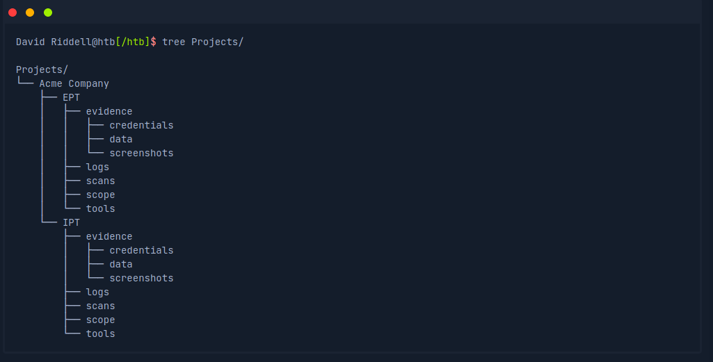

# Notes

* confidentiality, integrity, and availability of data," or the CIA triad
* As previously discussed, banner grabbing is a useful technique to fingerprint a service quickly. Often a service will look to identify itself by displaying a banner once a connection is initiated.
* As previously discussed, banner grabbing is a useful technique to fingerprint a service quickly. Often a service will look to identify itself by displaying a banner once a connection is initiated. nmap and nc can do this
* When performing service scanning, we will often run into web servers running on ports 80 and 443

Step | Explanation
-----|-------------
Identifying the Risk | Identifying risks the business is exposed to, such as legal, environmental, market, regulatory, and other types of risks.
Analyze the Risk | Analyzing the risks to determine their impact and probability. The risks should be mapped to the organization's various policies, procedures, and business processes.
Evaluate the Risk | Evaluating, ranking, and prioritizing risks. Then, the organization must decide to accept (unavoidable), avoid (change plans), control (mitigate), or transfer risk (insure).
Dealing with Risk | Eliminating or containing the risks as best as possible. This is handled by interfacing directly with the stakeholders for the system or process that the risk is associated with.
Monitoring Risk | All risks must be constantly monitored. Risks should be constantly monitored for any situational changes that could change their impact score, i.e., from low to medium or high impact.

## Types of shells

Shell Type | Description
-----------|------------
Reverse shell | Initiates a connection back to a "listener" on our attack box.
Bind shell | "Binds" to a specific port on the target host and waits for a connection from our attack box.
Web shell | Runs operating system commands via the web browser, typically not interactive or semi-interactive. It can also be used to run single commands (i.e., leveraging a file upload vulnerability and uploading a PHP script to run a single command.

## Ports

* A port can be thought of as a window or door on a house (the house being a remote system), if a window or door is left open or not locked correctly, we can often gain unauthorized access to a home. 

Port(s) | Protocol
--------|---------
20/21 (TCP) | FTP
22 (TCP) | SSH
23 (TCP) | Telnet
25 (TCP) | SMTP
80 (TCP) | HTTP
161 (TCP/UDP) | SNMP
389 (TCP/UDP) | LDAP
443 (TCP) | SSL/TLS (HTTPS)
445 (TCP) | SMB
3389 (TCP) | RDP

## OWASP Top 10

1. 	Injection 	SQL injection, command injection, LDAP injection, etc.
2. 	Broken Authentication 	Authentication and session management misconfigurations can lead to unauthorized access to an application through password guessing attacks or improper session timeout, among other issues.
3. 	Sensitive Data Exposure 	Improperly protecting data such as financial, healthcare, or personally identifiable information.
4. 	XML External Entities (XXE) 	Poorly configured XML processors that can lead to internal file disclosure, port scanning, remote code execution, or denial of service attacks.
5. 	Broken Access Control 	Restrictions are not appropriately implemented to prevent users from accessing other users accounts, viewing sensitive data, accessing unauthorized functionality, modifying data, etc.
6. 	Security Misconfiguration 	Insecure default configurations, open cloud storage, verbose error messages which disclose too much information.
7. 	Cross-Site Scripting (XSS) 	XSS occurs when an application does not properly sanitize user-supplied input, allowing for the execution of HTML or JavaScript in a victim's browser. This can lead to session hijacking, website defacement, redirecting a user to a malicious website, etc.
8. 	Insecure Deserialization 	This flaw often leads to remote code execution, injection attacks, or privilege escalation attacks.
9. 	Using Components with Known Vulnerabilities 	All of the components used by an application (libraries, frameworks, software modules) run with the same privilege as the application. If the application uses components with known flaws, it may lead to sensitive data exposure or remote code execution.
10. 	Insufficient Logging & Monitoring 	Deficiencies in logging & monitoring may allow a successful attack to go unnoticed, for attackers to establish persistence in the network, or tamper with or extract sensitive data without being noticed.

## nmap scripts

* -sC is used to specify a script (default)
* nmap --script <script name> -p<port> <host>

## ftp

* We see that FTP supports common commands such as cd and ls and allows us to download files using the get command. Inspection of the downloaded login.txt reveals credentials that we could use to further our access to the system.

## SMB
* MB (Server Message Block) is a prevalent protocol on Windows machines that provides many vectors for vertical and lateral movement. 
* some SMB versions may be vulnerable to RCE exploits such as EternalBlue
*  Nmap has many scripts for enumerating SMB, such as smb-os-discovery.nse, which will interact with the SMB service to extract the reported operating system version.

## Shares
* SMB allows users and administrators to share folders and make them accessible remotely by other users.
* A tool that can enumerate and interact with SMB shares is smbclient. The -L flag specifies that we want to retrieve a list of available shares on the remote host, while -N suppresses the password prompt.

## SNMP
* SNMP Community strings provide information and statistics about a router or device, helping us gain access to it.

## Gobuster

* For directory enumeration
* gobuster dir -u http://10.10.10.121/ -w /usr/share/dirb/wordlists/common.txt
* DNS Subdomain Enumeration
** Used to get things like admin pages gobuster dns -d inlanefreight.com -w /usr/share/SecLists/Discovery/DNS/namelist.txt

## Banner Grabbing / Web Server Headers

In the last section, we discussed banner grabbing for general purposes. Web server headers provide a good picture of what is hosted on a web server. They can reveal the specific application framework in use, the authentication options, and whether the server is missing essential security options or has been misconfigured. We can use cURL to retrieve server header information from the command line. cURL is another essential addition to our penetration testing toolkit, and familiarity with its many options is encouraged

## WhatWeb

We can extract the version of web servers, supporting frameworks, and applications using the command-line tool whatweb. This information can help us pinpoint the technologies in use and begin to search for potential vulnerabilities.